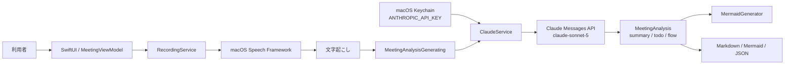

# アーキテクチャ

## 目的

会議の録音・文字起こしとAI解析を分離し、録音系を変更せずAI APIを差し替えられるmacOSネイティブ構成です。今回の変更では`MeetingAnalysisGenerating`境界の実装だけをClaudeへ置き換えています。

## 全体構成

## Claude解析のデータフロー

1. `MeetingViewModel`が会議タイトルと確定済み文字起こしを`MeetingAnalysisGenerating.analyze`へ渡します。
2. `ClaudeService`がKeychainを優先してAnthropic APIキーを取得します。
3. Claude Messages APIへsystem prompt、user message、`MeetingAnalysis`用JSON Schemaを送信します。
4. Structured Outputsのtext blockを`MeetingAnalysis`へdecodeします。
5. `flow`からアプリ側でMermaidを生成します。ClaudeにはMermaid生成を任せません。

## 設計判断

- Anthropic SDKは追加せず`URLSession`を使用し、依存追加と移行差分を抑えています。
- Structured Outputsで既存JSON Schemaを維持し、UI・Export・Mermaid生成への影響をなくしています。
- APIキーはKeychainへ保存し、保存値を画面へ再表示しません。
- 旧OpenAIキーとAnthropicキーを混同しないよう、Keychain accountを`ANTHROPIC_API_KEY`へ変更しています。
- エラー本文には会議内容が含まれる可能性があるため、画面やログへそのまま出しません。

## 依存関係と変更時の確認

| 変更対象 | 影響先 |
| --- | --- |
| Claude model / API version | `ClaudeService`、設定画面、単体テスト、運用手順 |
| JSON Schema | `MeetingAnalysis` decode、Export、Mermaid生成、API schema cache |
| Keychain account | APIキー設定、初回移行手順 |
| 録音・Speech | Claude APIとは独立。音声権限と一時ファイル運用に影響 |

## 現在の進捗

- 完了: Claude Messages API実装、Structured Outputs、APIキー設定変更、単体テスト更新
- 未完了: 実Anthropic APIによるE2E確認、Xcode 26環境での配布ビルド確認
- 次の作業: `TODO.md`の高優先度2項目
- リスク: モデル廃止、長時間会議の入力上限、APIキーを各利用者端末へ保存する運用
