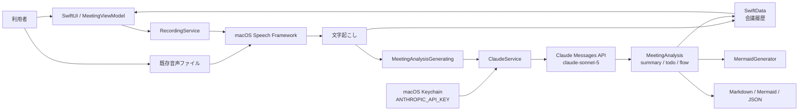

# アーキテクチャ

## 目的

会議の録音・文字起こし、AI解析、ローカル履歴保存を分離し、各処理を独立して変更できるmacOSネイティブ構成です。個人利用ではサーバーDBを持たず、SwiftDataを正本として会議履歴を端末内へ保存します。

## 全体構成

## Claude解析のデータフロー

1. `MeetingViewModel`が会議タイトルと確定済み文字起こしを`MeetingAnalysisGenerating.analyze`へ渡します。
2. `ClaudeService`がKeychainを優先してAnthropic APIキーを取得します。
3. Claude Messages APIへsystem prompt、user message、`MeetingAnalysis`用JSON Schemaを送信します。
4. Structured Outputsのtext blockを`MeetingAnalysis`へdecodeし、AI出力に限って議事録の必須見出しを補完します。
5. `flow`からアプリ側でMermaidを生成します。ClaudeにはMermaid生成を任せません。

## 設計判断

- Anthropic SDKは追加せず`URLSession`を使用し、依存追加と移行差分を抑えています。
- Structured Outputsで既存JSON Schemaを維持し、UI・Export・Mermaid生成への影響をなくしています。
- 議事録は目的・背景、主な議論、決定事項、未決事項・確認事項、次の対応を必須見出しとし、実行事項だけをToDoへ重複表示します。
- APIキーはKeychainへ保存し、保存値を画面へ再表示しません。
- 旧OpenAIキーとAnthropicキーを混同しないよう、Keychain accountを`ANTHROPIC_API_KEY`へ変更しています。
- エラー本文には会議内容が含まれる可能性があるため、画面やログへそのまま出しません。
- SwiftDataにはタイトル、文字起こし、構造化解析結果、作成・更新日時だけを保存します。録音音声と読み込み元音声は保存しません。
- 初期スキーマを`MeetingSchemaV1`として版管理し、将来の項目変更ではMigrationStageを追加して履歴を引き継ぎます。
- 保存処理は`MeetingHistoryStoring`境界で分離し、ViewModelの単体テストではインメモリ実装へ差し替えます。

## 依存関係と変更時の確認

| 変更対象 | 影響先 |
| --- | --- |
| Claude model / API version | `ClaudeService`、設定画面、単体テスト、運用手順 |
| JSON Schema | `MeetingAnalysis` decode、Export、Mermaid生成、API schema cache |
| Keychain account | APIキー設定、初回移行手順 |
| 録音・Speech | Claude APIとは独立。音声権限と一時ファイル運用に影響 |
| SwiftDataスキーマ | 既存会議履歴に影響。新しいVersionedSchemaと移行テストが必要 |
| Bundle Identifier | SwiftDataコンテナとKeychainの継続利用に影響。配布版では変更しない |

## 現在の進捗

- 完了: Claude Messages API、Structured Outputs、SwiftData履歴、既存音声読み込み、APIキー設定
- 未完了: 実Anthropic APIによるE2E確認、長時間の既存音声による実機確認
- 次の作業: `TODO.md`の高優先度項目
- リスク: モデル廃止、長時間会議の入力上限、端末故障に備えた履歴全体のバックアップ未実装
