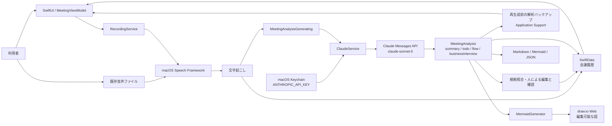

# アーキテクチャ

## 目的

会議の録音・文字起こし、AI解析、ローカル履歴保存を分離し、各処理を独立して変更できるmacOSネイティブ構成です。個人利用ではサーバーDBを持たず、SwiftDataを正本として会議履歴を端末内へ保存します。

## 全体構成

```mermaid
flowchart LR
  User["利用者"] --> UI["SwiftUI / MeetingViewModel"]
  UI --> Recorder["RecordingService"]
  User --> Import["既存音声ファイル"]
  Import --> Speech
  Recorder --> Speech["macOS Speech Framework"]
  Speech --> Transcript["文字起こし"]
  Transcript --> Store["SwiftData\n会議履歴"]
  Transcript --> Generator["MeetingAnalysisGenerating"]
  Keychain["macOS Keychain\nANTHROPIC_API_KEY"] --> Claude["ClaudeService"]
  Generator --> Claude
  Claude --> API["Claude Messages API\nclaude-sonnet-5"]
  API --> Analysis["MeetingAnalysis\nsummary / todo / flow / businessInterview"]
  Analysis --> Review["根拠照合・人による編集と確認"]
  Review --> Store
  Analysis --> Store
  Analysis --> PreviousAnalysis["再生成前の解析バックアップ\nApplication Support"]
  PreviousAnalysis --> UI
  Store --> UI
  Analysis --> Mermaid["MermaidGenerator"]
  Mermaid --> Drawio["draw.io Web\n編集可能な図"]
  Analysis --> Export["Markdown / Mermaid / JSON"]
```

## Claude解析のデータフロー

1. `MeetingViewModel`が会議タイトルと確定済み文字起こしを`MeetingAnalysisGenerating.analyze`へ渡します。
2. `ClaudeService`がKeychainを優先してAnthropic APIキーを取得します。
3. Claude Messages APIへsystem prompt、user message、`MeetingAnalysis`用JSON Schemaを送信します。
4. Structured Outputsのtext blockを`MeetingAnalysis`へdecodeし、AI出力に限って議事録の必須見出しを補完します。内容不足・壊れたJSON・ヒアリング欠落・根拠不一致は、保存前に具体的な修正指示で1回再要求します。
5. `flow`からアプリ側でMermaidを生成します。ClaudeにはMermaid生成を任せません。

## 設計判断

- Anthropic SDKは追加せず`URLSession`を使用し、依存追加と移行差分を抑えています。
- Structured OutputsのJSON Schemaに業務ヒアリングを追加し、既存summary・todo・flowの形式を維持しています。
- 議事録は目的・背景、主な議論、決定事項、未決事項・確認事項、次の対応を必須見出しとし、実行事項だけをToDoへ重複表示します。
- APIキーはKeychainへ保存し、保存値を画面へ再表示しません。
- 旧OpenAIキーとAnthropicキーを混同しないよう、Keychain accountを`ANTHROPIC_API_KEY`へ変更しています。
- エラー本文には会議内容が含まれる可能性があるため、画面やログへそのまま出しません。
- SwiftDataにはタイトル、文字起こし、構造化解析結果、作成・更新日時だけを保存します。録音音声と読み込み元音声は保存しません。
- AIを再生成する直前の有効な解析は、SwiftDataを上書きする前にApplication Supportへ退避します。直近の結果だけを「再生成前の結果に戻す」で復元できます。
- Mermaidタブのdraw.io導線は、Mermaid本文を`#create` URLで渡して編集可能なdraw.io図を直接生成します。draw.ioで編集した図はアプリへ自動保存せず、draw.io側で書き出します。
- 出力不足の自動再要求は1回だけとし、認証・通信・利用上限・会議本文の上限エラーは再要求しません。失敗時は既存の解析結果を保持します。
- ClaudeのMessages APIは`stream: true`で要求し、専用のephemeral URLSessionでSSEを逐次受信します。無応答の上限は300秒、1要求全体は900秒。全文を一度に送信し、原文の切り捨てや引用位置が変わる分割はしません。`message_stop`と停止理由が揃うまで結果を解析へ渡さず、受信断片は保存しません。キャンセル時はURLSessionの通信タスクも停止します。HTTP／SSEエラー本文は表示・記録せず、途中中断の自動再送は行いません。
- 議事録の本文をToDo・フローと独立して検証します。空・`placeholder`・見出しと未確認文だけのsummaryは拒否します。同じ判定を再生成前の退避にも使い、旧版で保存された内容不足の結果が有効なバックアップを上書きすることを防ぎます。保存済みJSONのdecodeは変更せず、既存履歴の読み込み・復元を維持します。
- 初期スキーマを`MeetingSchemaV1`として版管理し、将来の項目変更ではMigrationStageを追加して履歴を引き継ぎます。
- 保存処理は`MeetingHistoryStoring`境界で分離し、ViewModelの単体テストではインメモリ実装へ差し替えます。

## 業務ヒアリングの境界

- `BusinessInterview`は抽出時の原文スナップショットと項目を保持します。各項目の引用は空・不一致・複数箇所一致を拒否し、アプリがUTF-16位置とUUIDを計算します。引用の存在検証は解釈の正しさを保証しません。
- AIに許す値は分類・内容・会議での合意／提案／AI提案・引用だけです。AIからの確認済み状態は受け入れず、明示的な人の操作で確認します。編集後は未確認に戻します。
- 人が編集・確認した項目が一つでもあれば、再生成時にヒアリング全体を保持し、`interviewCandidate`に新候補を保存します。採用前に直近の解析を退避します。複数世代の履歴は保持しません。
- 保存済みJSON内の任意項目追加で旧履歴と互換にし、SwiftDataスキーマは変更しません。破損した解析は行単位で読み取り専用にし、保存・再生成・復元による上書きを防ぎます。
- JSONは候補と原文を含む完全データ、Markdownは確認状態と根拠を含む共有用出力です。Mermaid／draw.ioは従来の`flow`のみを使用します。

## 依存関係と変更時の確認

| 変更対象 | 影響先 |
| --- | --- |
| Claude model / API version | `ClaudeService`、設定画面、単体テスト、運用手順 |
| JSON Schema | `MeetingAnalysis` decode、Export、Mermaid生成、API schema cache |
| Keychain account | APIキー設定、初回移行手順 |
| 録音・Speech | Claude APIとは独立。音声権限と一時ファイル運用に影響 |
| SwiftDataスキーマ | 既存会議履歴に影響。新しいVersionedSchemaと移行テストが必要 |
| Bundle Identifier | SwiftDataコンテナとKeychainの継続利用に影響。配布版では変更しない |

## 現在の進捗

- 完了: Claude Messages API、Structured Outputs、SwiftData履歴、既存音声読み込み、APIキー設定、根拠付き業務ヒアリングと人の確認・編集保護
- 未完了: 長時間の実会議の抽出品質、長時間の既存音声による実機確認（短い架空会議での実API接続は検証済み）
- 次の作業: `TODO.md`の高優先度項目
- リスク: モデル廃止、長時間会議の入力上限、端末故障に備えた履歴全体のバックアップ未実装
